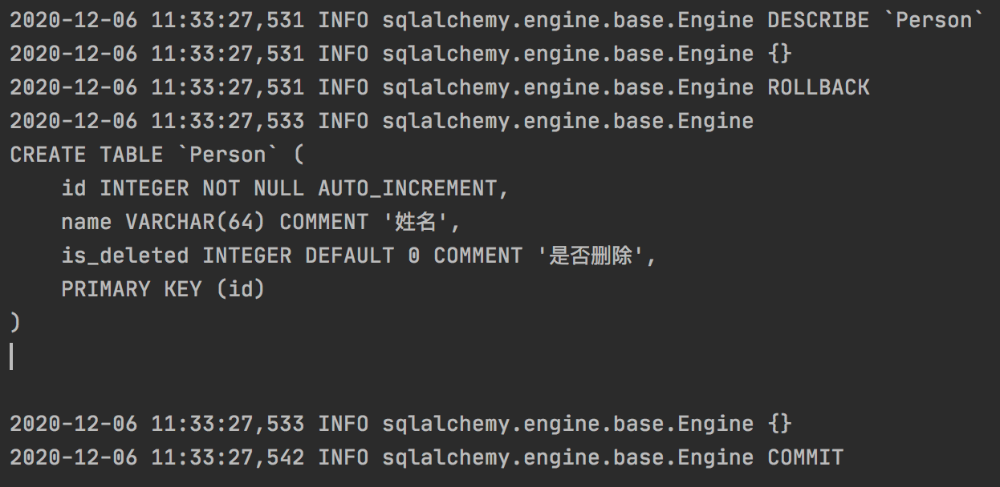
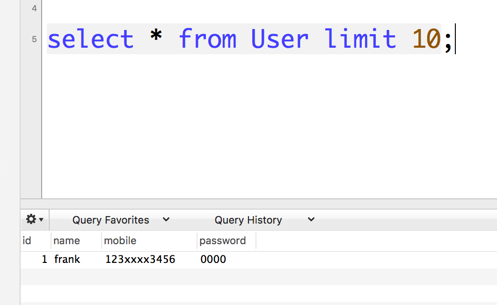

# sqlalchemy 的column的默认值属性


## 来聊一下 sqlalchemy 的column 的默认值 


我们知道 使用 sqlalchemy 定义 ORM 对象，需要给一些 字段设置一个默认值，  default 属性 


类似下面的代码

```python
  class Person(Base):
    __tablename__ = 'Person'

    id = Column(Integer, autoincrement=True, primary_key=True)
    name = Column(String(length=64), comment='姓名')
    is_delete = Column(Integer,comment="是否删除",default=0)
    
    def __repr__(self):
        return "<Person(id='%s', name='%s', mobile='%s')>" % \
               (self.id,
                self.name, self.mobile, )
  

```


这样就可以 在 session.add() , session.commit() 的时候，如果没有提供这个字段的值，就会自动设置会0 写入到数据库里面。


我用这个类 创建表的时候 发现， 其实 sqlalchemy 并没有进行 设置， 表结构里面的默认值。 


通过上面的日志 ，我可以清晰的发现，实际上engine 来执行sql 是上面的建表语句，并没有将 is_deleted 设置成 默认值。


后来发现 其实 Column 还有一个属性，叫 `server_default` 这个值 才是真正可以生成表结构的时候，会设置默认值。 


但是 我设置 server_default 值的时候

```python
class Person(Base):
    __tablename__ = 'Person'

    id = Column(Integer, autoincrement=True, primary_key=True)
    name = Column(String(length=64), comment='姓名')
    
    # 这里设置 server_default 值 
    is_deleted = Column(Integer,comment="是否删除",default=0,server_default=0)
    def __repr__(self):
        return "<Person(id='%s', name='%s', mobile='%s')>" % \
               (self.id,
                self.name, self.mobile, )
```


之后生成表结构的时候，发现出现了一个错误如下：

**Argument 'arg' is expected to be one of type '<class 'str'>'**

```text
sqlalchemy.exc.ArgumentError: Argument 'arg' is expected to be one of type '<class 'str'>' or '<class 'sqlalchemy.sql.elements.ClauseElement'>' or '<class 'sqlalchemy.sql.elements.TextClause'>', got '<class 'int'>'

```


这里很明显 说明 参数 错误， 我陷入了沉思？ 为啥说我参数不对呢？ 


源码 `sqlalchemy.sql.schema.py`  查看 server_default  要求传入一个字符串类型的变量。 


修改 orm 类 

```python
from sqlalchemy import Column, Integer, String, text


class Person(Base):
    __tablename__ = 'Person'

    id = Column(Integer, autoincrement=True, primary_key=True)
    name = Column(String(length=64), comment='姓名')
    # 注意这里 只设置 server_default 
    is_deleted = Column(Integer, comment="是否删除", server_default=text('0'))

    def __repr__(self):
        return "<Person(id='%s', name='%s', mobile='%s')>" % \
               (self.id,
                self.name, self.mobile,)

```


执行 生成 table 语句 ，发现可以正常生成表结构了，并且default  值 也默认设置好了。




好了，一切看起来 完美了。 


## server default   vs. default 

sqlalchemy.exc.ArgumentError: Argument 'arg' is expected to be one of type '<class 'str'> ,not <class 'int'>

关于sqlalchemy 中  字段 default 属性 


## demo 示例

下面以一个例子作为演示，下面我创建一个User 的model 类 ， 然后 有一个字段 password 我设置一个 default 的属性 ，然后创建一个表


```python
from sqlalchemy.ext.declarative import declarative_base
from sqlalchemy import Column, Integer, String, create_engine
from sqlalchemy.orm import sessionmaker

Base = declarative_base()

# 创建连接对象，并使用 pymsql 引擎
conn_str = "mysql+pymysql://{user}:{pwd}@{host}:3306/{db_name}?charset=utf8mb4"
connect_info = conn_str.format(user='root',

                               pwd='123456',
                               host='127.0.0.1',
                               db_name='db1')

engine = create_engine(connect_info, max_overflow=5)

session_factory = sessionmaker()
session_factory.configure(bind=engine)

session = session_factory()


class User(Base):
    __tablename__ = 'User'

    id = Column(Integer, autoincrement=True, primary_key=True)
    name = Column(String(length=64), comment='姓名')
    mobile = Column(String(length=64), comment='手机号')
    password = Column(String(length=64), comment='密码', default='0000')

    def __repr__(self):
        return "<User(id='%s', name='%s', mobile='%s', password='%s')>" % \
               (self.id,
                self.name, self.mobile, self.password)


def create_table():
    # 创建表结构
    Base.metadata.create_all(engine)


if __name__ == '__main__':

    create_table()
    print("create table successfully ")
```


创建完成后，我们到数据库查看表结构 ，发现 并没有 给password 一个默认值。

建表语句 如下： 

```mysql
CREATE TABLE `User` (
  `id` int(11) NOT NULL AUTO_INCREMENT,
  `name` varchar(64) DEFAULT NULL COMMENT '姓名',
  `mobile` varchar(64) DEFAULT NULL COMMENT '手机号',
  `password` varchar(64) DEFAULT NULL COMMENT '密码',
  PRIMARY KEY (`id`)
) ENGINE=InnoDB AUTO_INCREMENT=2 DEFAULT CHARSET=latin1;
```


并没有给 password 生成一个 密码的default 值。 


下面我们使用 sqlalchemy 插入一个 user 


```python
if __name__ == '__main__':
    u = User(name='frank',mobile='123xxxx3456')
    session.add(u)
    session.commit()
    session.close()
```


数据库查看 没有任何问题，已经自动把 password 字段 填充成0000了。




这是在执行sql 的时候，当 ORM对象 没有给某个字段赋值的时候，   sqlalchemy 会查看 Column 属性的default 是否有值，如果有值，则会默认为default值。然后在进行 执行sql ,所以就自动加上了默认值。


<sqlalchemy.orm.session.Session object at 0x10c80e390>


obj =state.obj()

<sqlalchemy.orm.state.InstanceState object at 0x10cd590d0>


```
正确的设置方式是
db.Column(db.Integer, default=0, server_default='0')
```

如果没有写server_default参数，那么在代码中新建对象往数据库插入的时候是有一个值的，但是在数据库里查看表结构，会发现表上并没有给字段设置默认值。

另外server_default的值必须是字符串。


https://docs.sqlalchemy.org/en/13/core/types.html