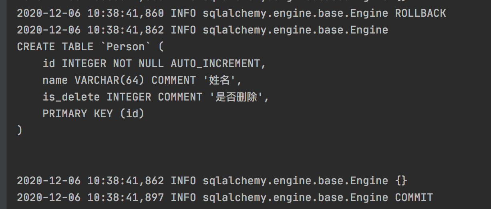
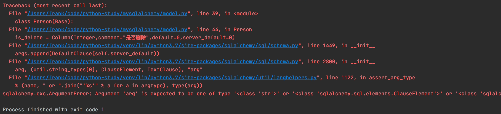
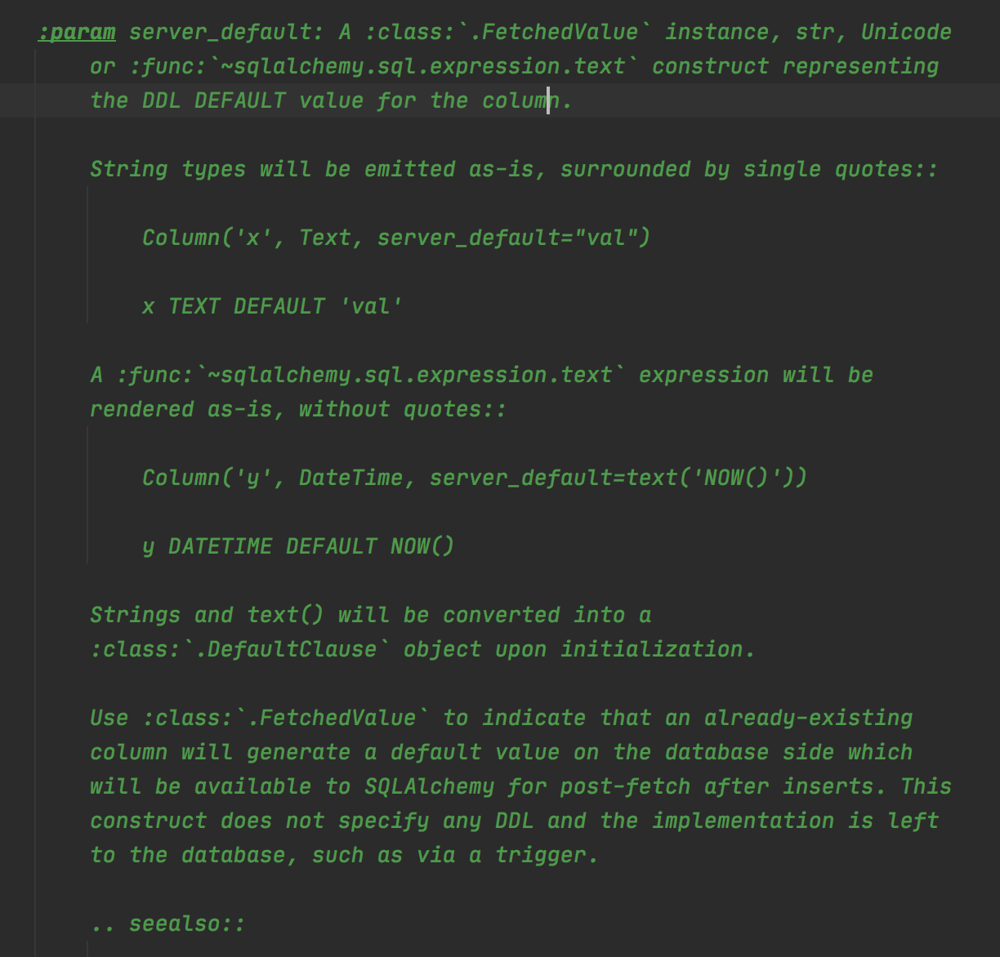
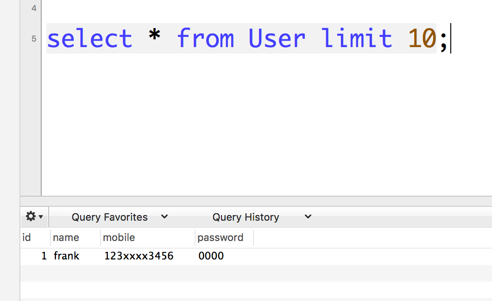

sqlalchemy中Column的默认值属性
==============================

​ 我们知道 使用 sqlalchemy 定义 ORM 对象，需要给一些
字段设置一个默认值， default 属性

类似下面的代码.

.. code:: python

     class Person(Base):
       __tablename__ = 'Person'

       id = Column(Integer, autoincrement=True, primary_key=True)
       name = Column(String(length=64), comment='姓名')
       is_delete = Column(Integer,comment="是否删除",default=0)
       
       def __repr__(self):
           return "<Person(id='%s', name='%s', mobile='%s')>" % \
                  (self.id,
                   self.name, self.mobile, )
     

这样就可以 在 session.add() , session.commit()
的时候，如果没有提供这个字段的值，就会自动设置会0 写入到数据库里面。

我用这个类 创建表的时候 发现， 其实 sqlalchemy 并没有进行 设置，
表结构里面的默认值。

   20201206104137582.png

通过上面的日志 ，我可以清晰的发现，实际上engine 来执行sql
是上面的建表语句，并没有将 is_deleted 设置成 默认值。

后来发现 其实 Column 还有一个属性，叫 ``server_default`` 这个值
才是真正可以生成表结构的时候，会设置默认值。

但是 我设置 server_default 值的时候

.. code:: python

   class Person(Base):
       __tablename__ = 'Person'

       id = Column(Integer, autoincrement=True, primary_key=True)
       name = Column(String(length=64), comment='姓名')
       
       # 这里设置 server_default 值 
       is_deleted = Column(Integer,comment="是否删除",default=0,server_default=0)
       def __repr__(self):
           return "<Person(id='%s', name='%s', mobile='%s')>" % \
                  (self.id,
                   self.name, self.mobile, )

之后生成表结构的时候，发现出现了一个错误如下：

**Argument ‘arg’ is expected to be one of type ‘<class ’str’>’**

.. code:: text

   sqlalchemy.exc.ArgumentError: Argument 'arg' is expected to be one of type '<class 'str'>' or '<class 'sqlalchemy.sql.elements.ClauseElement'>' or '<class 'sqlalchemy.sql.elements.TextClause'>', got '<class 'int'>'

   image-20201206104911808

这里很明显 说明 参数 错误， 我陷入了沉思？ 为啥说我参数不对呢？

源码 ``sqlalchemy.sql.schema.py`` 查看 server_default
要求传入一个字符串类型的变量。

   image-20201206111853684

修改 orm 类

.. code:: python

   from sqlalchemy import Column, Integer, String, text

   class Person(Base):
       __tablename__ = 'Person'

       id = Column(Integer, autoincrement=True, primary_key=True)
       name = Column(String(length=64), comment='姓名')
       # 注意这里 只设置 server_default 
       is_deleted = Column(Integer, comment="是否删除", server_default=text('0'))

       def __repr__(self):
           return "<Person(id='%s', name='%s')>" % \
                  (self.id,
                   self.name)

执行生成 table 语句 ，发现可以正常生成表结构了，并且default 值
也默认设置好了。

.. figure:: ./image/default_vs_server_default/image-20201206113614276.png
   :alt: image-20201206113614276

   image-20201206113614276

好了，一切看起来 完美了。

所以 如果要想 定义orm ，生成表结构的时候，就自动生成 默认值，一定要使用
``server_default`` 这个 字段，并且要求 这个字段为字符串类型， 可以使用
``text`` 去 装饰一下。

server_default vs. default 的区别
---------------------------------

​ 在sqlalchemy 中 定义Column 字段 可以有两个default 相关的字段， 一个是
``default`` 另一个是 ``server_default`` ,他们之间的区别呢?

查看源码位置 sqlalchemy.sql.schema.py ``Column`` 这个类

``default`` 这个属性 ，就是默认生成orm 对象,如果某个字段没有
传值，就使用default 值，然后写入到数据库中。

``server_default`` 这个属性，要求是一个str, unicode 类型。
用来生成表结构的时候， 需要指定字段默认值的时候来指定的。

看一个小例子
~~~~~~~~~~~~

下面以一个例子作为演示，下面我创建一个User 的model 类 ， 然后 有一个字段
password 我设置一个 default 的属性 ，然后创建一个表。

.. code:: python

   from sqlalchemy.ext.declarative import declarative_base
   from sqlalchemy import Column, Integer, String, create_engine
   from sqlalchemy.orm import sessionmaker

   Base = declarative_base()

   # 创建连接对象，并使用 pymsql 引擎
   conn_str = "mysql+pymysql://{user}:{pwd}@{host}:3306/{db_name}?charset=utf8mb4"
   connect_info = conn_str.format(user='root',

                                  pwd='123456',
                                  host='127.0.0.1',
                                  db_name='db1')

   engine = create_engine(connect_info, max_overflow=5)

   session_factory = sessionmaker()
   session_factory.configure(bind=engine)

   session = session_factory()

   class User(Base):
       __tablename__ = 'User'

       id = Column(Integer, autoincrement=True, primary_key=True)
       name = Column(String(length=64), comment='姓名')
       mobile = Column(String(length=64), comment='手机号')
       password = Column(String(length=64), comment='密码', default='0000')

       def __repr__(self):
           return "<User(id='%s', name='%s', mobile='%s', password='%s')>" % \
                  (self.id,
                   self.name, self.mobile, self.password)

   def create_table():
       # 创建表结构
       Base.metadata.create_all(engine)

   if __name__ == '__main__':

       create_table()
       print("create table successfully ")

创建完成后，我们到数据库查看表结构 ，发现 并没有 给password 一个默认值。

建表语句 如下：

.. code:: mysql

   CREATE TABLE `User` (
     `id` int(11) NOT NULL AUTO_INCREMENT,
     `name` varchar(64) DEFAULT NULL COMMENT '姓名',
     `mobile` varchar(64) DEFAULT NULL COMMENT '手机号',
     `password` varchar(64) DEFAULT NULL COMMENT '密码',
     PRIMARY KEY (`id`)
   ) ENGINE=InnoDB AUTO_INCREMENT=2 DEFAULT CHARSET=latin1;

User 表结构中并没有给 password 生成一个 密码的default 值。

下面我们使用 sqlalchemy 插入一个 user

.. code:: python

   if __name__ == '__main__':
       u = User(name='frank',mobile='123xxxx3456')
       session.add(u)
       session.commit()
       session.close()

数据库查看 没有任何问题，已经自动把 password 字段 填充成0000了。

   image-20201205151915773

这是在执行sql 的时候，当 ORM对象 没有给某个字段赋值的时候， sqlalchemy
会查看 Column 属性的default 是否有值，如果有值，则使用 当前值;
如果没有值，则会默认为default值。

然后在进行执行sql ,所以就自动加上了默认值。

因此想要在表结构生成的时候 就设置默认值， 要使用 ``server_default``
这个属性，另外server_default的值必须是字符串。

.. code:: python

   # 正确的设置方式是
   is_deleted = Column(Integer, default=0, server_default=text('0'))

如果没有写server_default参数，那么在代码中新建对象往数据库插入的时候是有一个值的，但是在数据库里查看表结构，会发现表上并没有给字段设置默认值。

另外server_default的值必须是字符串。

设置表的默认创建时间和更新时间
------------------------------

​ 有的时候我们希望在表创建的时候，有创建 时间和更新时间。 所以
我们就可以使用 ``server_default`` 这个属性 来生成就好了。

.. code:: python

   from sqlalchemy import TIMESTAMP, Boolean, Column, Float
   from sqlalchemy.ext.declarative import declarative_base

   base = declarative_base()

   class Base(base):
       __abstract__ = True
       __table_args__ = {
           'mysql_engine': 'InnoDB',
           'mysql_charset': 'utf8',
           'extend_existing': True
       }
       id = Column(INT, primary_key=True, autoincrement=True)
       
       create_time = Column(TIMESTAMP, default=None, nullable=True,
                            server_default=text('CURRENT_TIMESTAMP'))
       update_time = Column(TIMESTAMP, default=None, nullable=True,
                            server_default=text(
                                'CURRENT_TIMESTAMP ON UPDATE CURRENT_TIMESTAMP'))
       

参考文档
--------

`stackoverflow
discussion <https://stackoverflow.com/questions/13370317/sqlalchemy-default-datetime/33532154#33532154>`__

`官方文档 <https://docs.sqlalchemy.org/en/13/core/types.html>`__

.. raw:: html

   

分享快乐,留住感动. ‘2020-12-07 21:08:08’ –frank

.. raw:: html

   

