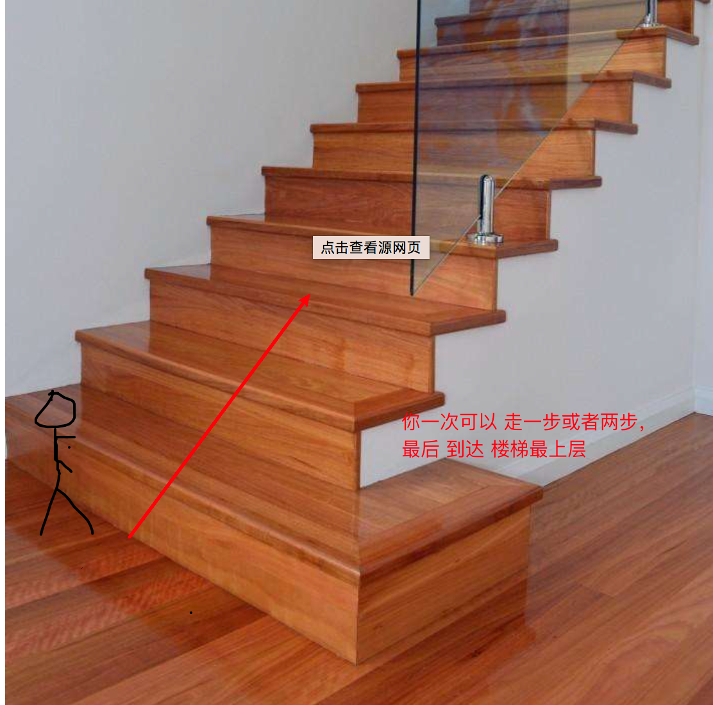
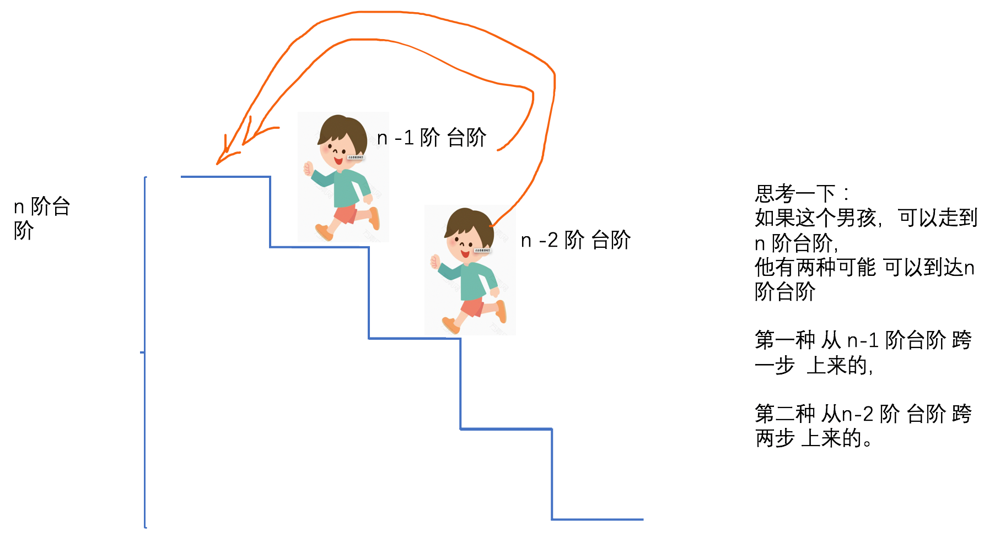
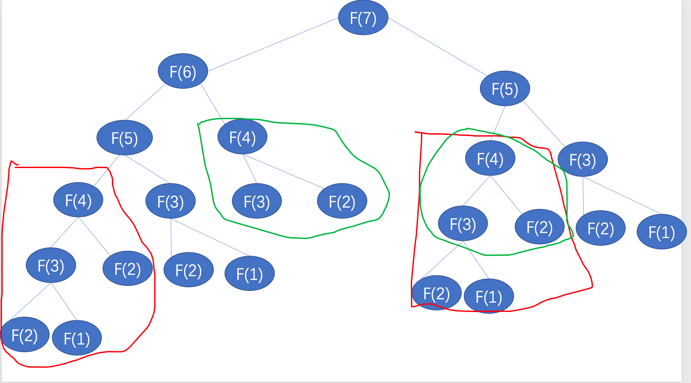
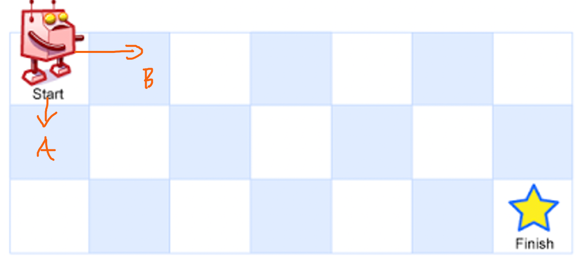
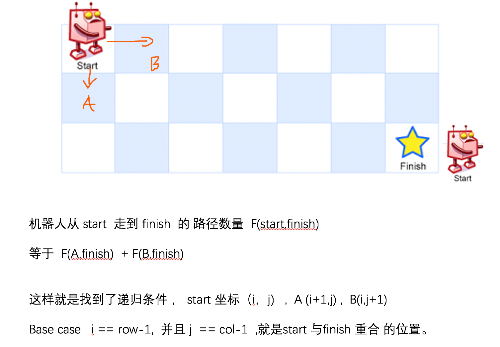
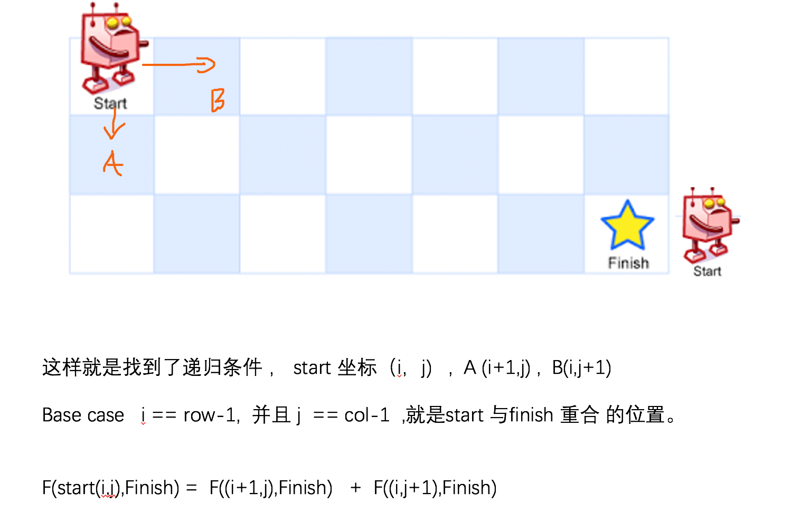

# 如何使用递归

[TOC]


## 1 递归概念 引入 

​	

​	首先 思考一个小小的问题，计算机 是如何解决问题的？  在计算机的世界里面 只有简单的 

if  else , for  loop , while ,do while , recursion  等这些简单的指令集，计算机 是一个没有感情的机器，计算机更加喜欢 做的事情 是什么呢？  


就是 **重复性的问题**，计算机特别擅长。


所以 递归（recursion ） 就诞生了，所以 递归是什么呢？ 递归就是自己调用自己的一个过程，是一种编程的技巧。 


### 1.1来举一个简单 例子 

比如现在 我要计算  1 + 2 + ... 100  ,举一个不是特别恰当的例子，假设  我现在有一个函数 可以从50 到100 计算和， 那么我只需要计算 1到50 的和，然后调用另外一个函数 计算 结果，然后把结果加起来。

```python
def sum_to_hundred():
    """
    计算 1 + 2 + ... 100
    :return:
    """
    r = 0
    for i in range(1, 50):
        r += i

    r2 = sum_50_100()
    return r + r2


def sum_50_100():
    """
    计算 50 到100 的和
    :return:
    """
    sum = 0
    for i in range(50, 101):
        sum += i
    return sum

if __name__ == '__main__':

    r = sum_to_hundred()
    print(r)
```

例子 应该比较简单，但是我们应该思考 一个问题， 1 + 2 + 3 ...+98+ 99+  100 这个问题 会有一些自相似性。

换个角度想一想，如果我要计算1 + 2 + 3 ...+ 98+ 99 +  100  的和， 

如果是可以知道假设 1 + 2 + 3 ...+98+ 99 = X  ，上面的式子   X + 100 

如果是可以知道假设 1 + 2 + 3 ...+98 = Y  ，上面的式子  Y + 99  + 100 

如果是可以知道假设 1 + 2 + 3 ...+97 = Z  ，上面的式子  Z  + 98 + 99  + 100

....


那么我们知道什么，很简单啊， 

1 = XXX  等于 1 ，这里就是找了最初的结果。 所以我们尝试 用递归的方式 来实现一下 这个函数。

```python

def recur(n=100):
		# base case 
    if n == 1:
        return 1
    return recur(n - 1) + n
```


这里我定义 recur(n)  表示的 从 [1,n] 的和.

recur(5)

recur(4) + 5 

(recur(3) + 4) + 5 

((recur(2) + 3)+ 4) + 5 

(( (recur(1) + 2)  + 3) + 4) + 5     

因为 recur(1) 的结果我们 很清楚啊，就是1 ，所以计算机 就把 1 +2 +...+ 5 的结果 计算出来了。


### 1.2递归的一些必要条件 

思考一下 递归需要哪些 必要的条件

- base case   就是 基线 的条件 

- 递归条件 

递归的基线条件 就是 何时 结束递归 函数进行返回 上一个例子中， 就是 n==1 ，这个条件 就是基线条件  

第二点  递归的递归条件， 递归条件 是如何把 递归往 递归 条件上 改变的条件， 随着递归条件的不断变化，最终 可以到达 基线条件。 上一个求和的例子中    `recur(n)  = recur(n-1) + n`  这个就是递归条件。


我们按照算法时间复杂度的角度 重新思考这个问题， n  相当于问题规模， 递归条件 每次 把问题规模减低到一个 ， 最后降到 我们可以直接就可以看出结果的条件(base case). 


好，现在 练手一下，如果 需要算法 `n!`   请使用递归的方式写出来

首先 思考 ： 基线条件是什么？  第二 递归条件是什么 ？ 

```python
def factorial(n: int) -> int:
    if n == 1:
        return 1
    return factorial(n - 1) * n

```


## 2 如何使用递归 

刚刚举例子，是比较简单的，这个时候你可能并没有感觉到递归 带来的好处是什么，我举几个稍微复杂的例子，

大家一起思考。


### 爬楼梯问题

<p>假设小明正在爬楼梯。需要 <em>n</em>&nbsp;阶你才能到达楼顶。</p>

<p>每次你可以爬 1 或 2 个台阶。你有多少种不同的方法可以爬到楼顶呢？</p>

<p><strong>注意：</strong>给定 <em>n</em> 是一个正整数。</p>

<p><strong>示例 1：</strong></p>

<pre><strong>输入：</strong> 2
<strong>输出：</strong> 2
<strong>解释：</strong> 有两种方法可以爬到楼顶。
1.  1 阶 + 1 阶
2.  2 阶</pre>

<p><strong>示例 2：</strong></p>

<pre><strong>输入：</strong> 3
<strong>输出：</strong> 3
<strong>解释：</strong> 有三种方法可以爬到楼顶。
1.  1 阶 + 1 阶 + 1 阶
2.  1 阶 + 2 阶
3.  2 阶 + 1 阶
</pre>


假设小明 现在 在楼梯的开始上楼， 




思考一下：

如果 小明 可以跳到 n 阶台阶，则 只有两种方案 可以跳上来。 

假设 f(n) 表示 跳到 n 阶台阶的方法数， 那么 

f(n)  = f(n-1) + f(n-2)


想一想 base case 

f(1) = 1

f(2) = 2 




那么 比较容易些出来 以下的代码。

```python
class Solution:
  
    def climbStairs(self, n: int) -> int:
        if n <= 2:
            return n
        else:
            return self.climbStairs(n-1) + self.climbStairs(n-2)
```


思考一下 这个 代码有没有什么问题呢？


画一下 递归的状态树， 这里 大概画了一下， 

我们 从一下 可以看出 递归的状态 有大量的重复计算的问题。 如何解决这个问题呢？ 

其中 红色 部分， 绿色部分 都进行了重复的计算，所以可以把计算的结果 先保存起来，如果发现这个值 已经计算过了，直接 使用之前计算过的值 即可。





优化后的代码：

把重复计算的结果 保存起来

```python
class Solution:

    memo = dict()

    def climbStairs(self, n: int) -> int:
        if n in self.__class__.memo:
            return self.__class__.memo[n]

        if n <= 2:
            self.__class__.memo[n] = n
        else:
            r = self.climbStairs(n - 1) + self.climbStairs(n - 2) 
            self.__class__.memo[n] = r
        return self.__class__.memo[n]
```


使用内置的 lru_cache 进行缓存 就行， 不用自己手写 lru_cache 

```python
from functools import lru_cache

class Solution:

    @lru_cache(maxsize=128)
    def climbStairs(self, n: int) -> int:
        if n <= 2:
            return n
        else:
            return self.climbStairs(n-1) + self.climbStairs(n-2)
```


更好的解法 dp 法

```python
class Solution:
  
	def climbStairs(self, n: int) -> int:

        if n <= 2:
            return n
        dp = [0] * (n + 1)
        dp[0] = 0
        dp[1] = 1
        dp[2] = 2

        for i in range(3, n + 1):
            dp[i] = dp[i - 1] + dp[i - 2]
        return dp[n]
```


### 括号生成问题 


<p>数字 <em>n</em>&nbsp;代表生成括号的对数，请你设计一个函数，用于能够生成所有可能的并且 <strong>有效的 </strong>括号组合。</p>

<p>&nbsp;</p>

<p><strong>示例：</strong></p>

<pre><strong>输入：</strong>n = 3
<strong>输出：</strong>[
       &quot;((()))&quot;,
       &quot;(()())&quot;,
       &quot;(())()&quot;,
       &quot;()(())&quot;,
       &quot;()()()&quot;
     ]
</pre>


有效括号的含义 是指   是一个成对出现的括号， 是一个合法的括号的表达方式， 就如上面的例子。


先假设 没有 要求括号合法性 的要求

```python
from typing import List

class Solution:
    def generateParenthesis(self, n: int) -> List[str]:

        max_level = 2*n
        level = 0
        cur_result = ""
        self._generate(max_level=max_level,level=level,cur_result=cur_result)


    def _generate(self,max_level,level, cur_result):
        #  terminator
        if level == max_level:
            print(cur_result)
            # notice
            return

        # current logic ,and drill down next  level
        self._generate(max_level,level+1,cur_result+"(")
        self._generate(max_level,level+1,cur_result+")")

        # reverse  current level status
        pass
```


加上如何检查 括号的合法性的逻辑 


其实递归的过程中，我们可以检查 一些不合法的括号，直接 停止递归就好了。

对于左括号，如果括号没有用完，就可以直接添加。

对于右括号， 要保证 左括号的了数量> 右括号的数量，就可以继续添加了。


```python
from typing import List

class Solution:
    def generateParenthesis(self, n: int) -> List[str]:

        max_level = n
        cur_result = ""
        left,right = 0,0
        self.result = []
        self._generate(max_level=max_level, left=left,right=right,cur_result=cur_result)
        return self.result


    def _generate(self,max_level,left,right, cur_result):
        #  terminator
        if left == max_level and right == max_level:
            # print(cur_result)
            self.result.append(cur_result)
            # notice
            return

        # current logic  ,and drill down
        if left < max_level:
            self._generate(max_level,left+1,right,cur_result+"(")
        if left > right:
            self._generate(max_level, left, right + 1, cur_result + ")")

        # reverse  current level status
        pass
```


这里 有一个模板尝试找一些题目进行练习。

```python
# python
def recursion(level, param1, param2, ...): 
    # recursion terminator 
    if level > MAX_LEVEL: 
	   process_result 
	   return 
    # process logic in current level 
    process(level, data...) 
    # drill down 
    self.recursion(level + 1, p1, ...) 
    # reverse the current level status if needed
    # pass
    
```


###  路径计数问题 


<p>一个机器人位于一个 <em>m x n </em>网格的左上角 （起始点在下图中标记为&ldquo;Start&rdquo; ）。</p>

<p>机器人每次只能向下或者向右移动一步。机器人试图达到网格的右下角（在下图中标记为&ldquo;Finish&rdquo;）。</p>

<p>问总共有多少条不同的路径？</p>

<p></p>

<p><small>例如，上图是一个7 x 3 的网格。有多少可能的路径？</small></p>

<p>&nbsp;</p>

<p><strong>示例&nbsp;1:</strong></p>

<pre><strong>输入:</strong> m = 3, n = 2
<strong>输出:</strong> 3
<strong>解释:</strong>
从左上角开始，总共有 3 条路径可以到达右下角。
1. 向右 -&gt; 向右 -&gt; 向下
2. 向右 -&gt; 向下 -&gt; 向右
3. 向下 -&gt; 向右 -&gt; 向右
</pre>

<p><strong>示例&nbsp;2:</strong></p>

<pre><strong>输入:</strong> m = 7, n = 3
<strong>输出:</strong> 28</pre>

<p>&nbsp;</p>

<p><strong>提示：</strong></p>

<ul>
	<li><code>1 &lt;= m, n &lt;= 100</code></li>
	<li>题目数据保证答案小于等于 <code>2 * 10 ^ 9</code></li>
</ul>





由于机器人只能  向右 或者向下 走 。 这样就走到了重复 子问题了。 








递归的写法 

```python
class Solution:
    def uniquePaths(self, m: int, n: int) -> int:
        i, j = 0, 0
        r = self.count_path(m, n, i, j)
        return r

    def count_path(self, row, col, i, j):
        # terminator
        if i >= row or j >= col:
            return 0
        if i == row-1 and j == col-1:
            # find a  result 
            return 1
        return self.count_path(row, col, i + 1, j) + self.count_path(row, col, i, j + 1)

```


记忆化搜索  可以把结果存起来

```python
class Solution:
    def uniquePaths(self, m: int, n: int) -> int:
        i, j = 0, 0
        self.memo = dict()
        r = self.count_path(m, n, i, j)
        return r

    def count_path(self, row, col, i, j):
        if (i,j) in self.memo:
            return self.memo.get((i,j))

         # terminator
        if i >= row or j >= col:
            self.memo[(i, j)] = 0
            return self.memo[(i, j)]
        if i == row-1 and j == col-1:
            self.memo[(i, j)] = 1
            return self.memo[(i, j)]

        self.memo[(i, j)] = self.count_path(row, col, i + 1, j) + self.count_path(row, col, i, j + 1)
        return self.memo[(i,j)]
```


有没有 更好的办法？ 可以自行思考一下.   


## 3 递归的效率问题

递归 有哪些 问题呢？ 

效率对比 

递归的话，需要额外的栈的空间开销，这个需要一定空间成本的。  对于for 循环 就 不太需要，直接循环，不需要 额外的栈空间。 


```python

def recur(n=100):
    if n == 1:
        return 1
    return recur(n - 1) + n


def my_sum(n):
    _sum = 0
    for i in range(n):
        _sum += i
    return _sum


if __name__ == '__main__':
    n = 500
    start = time.time()
    print(my_sum(n=n))
    print(f"my_sum totoal time :{time.time() - start}")

    start = time.time()
    print(recur(n=n))
    print(f"recur totoal time :{time.time() - start}")
    pass
```


## 总结 

递归的关键 要点  第一 要找到 最近重复子问题，第二要找base case 基线条件 。 然后 开始 写递归，递归过程中一定 不要忘记 递归的终止条件。


## 参考文档

[爬楼梯问题](https://leetcode-cn.com/problems/climbing-stairs/)  
[括号生成问题](https://leetcode-cn.com/problems/generate-parentheses/) 
[不同路径](https://leetcode-cn.com/problems/unique-paths/)

[组合](https://leetcode-cn.com/problems/combinations/)
[全排列](https://leetcode-cn.com/problems/permutations/)
[全排列 II ](https://leetcode-cn.com/problems/permutations-ii/)


​	