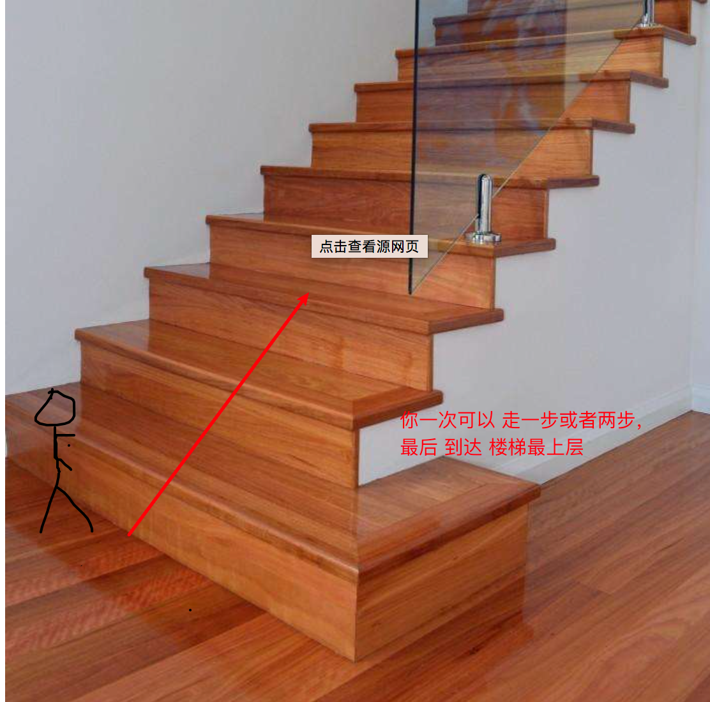
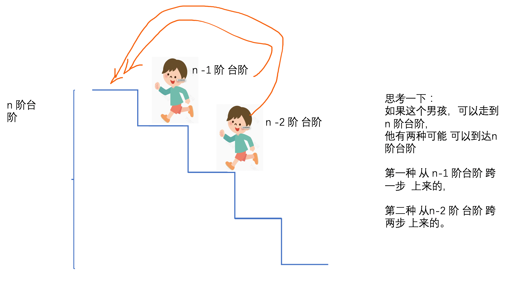
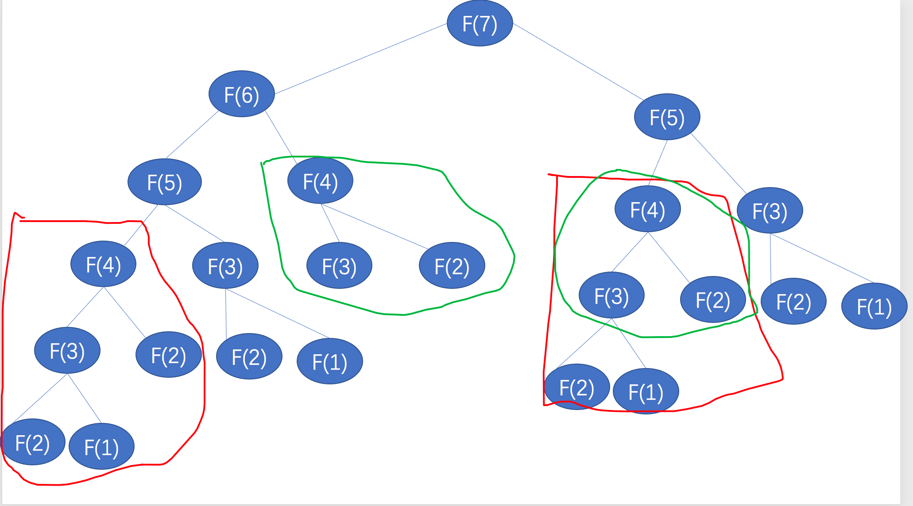
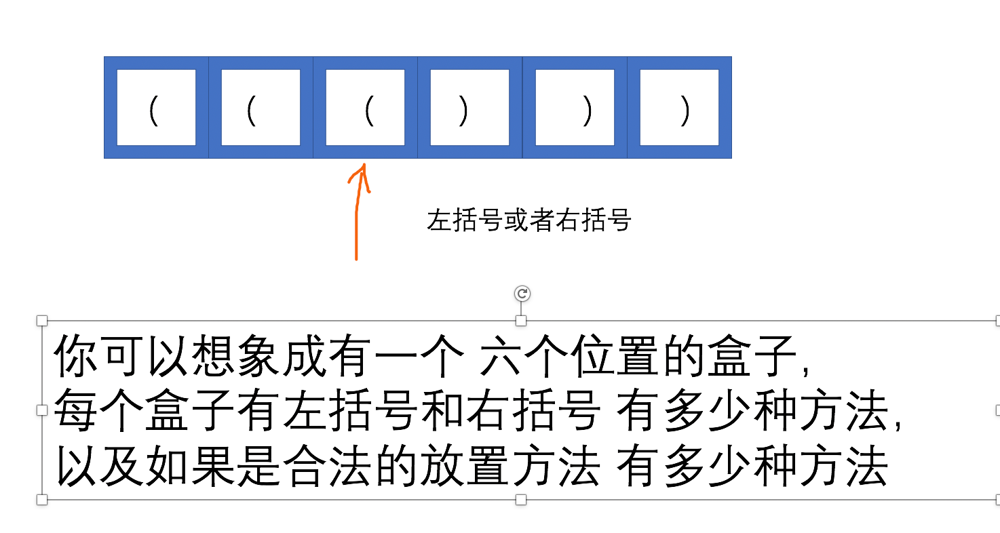
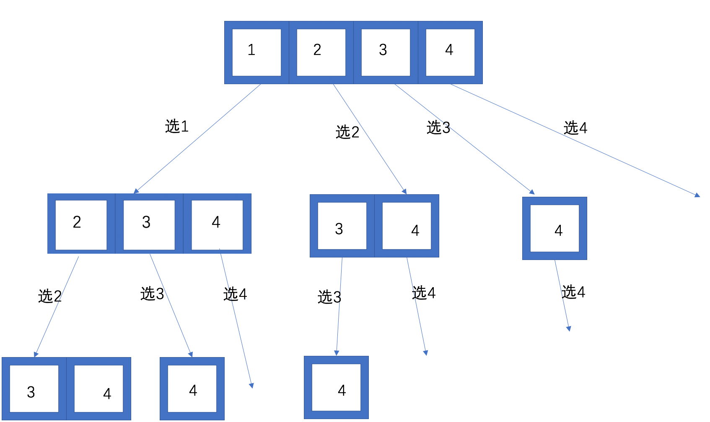
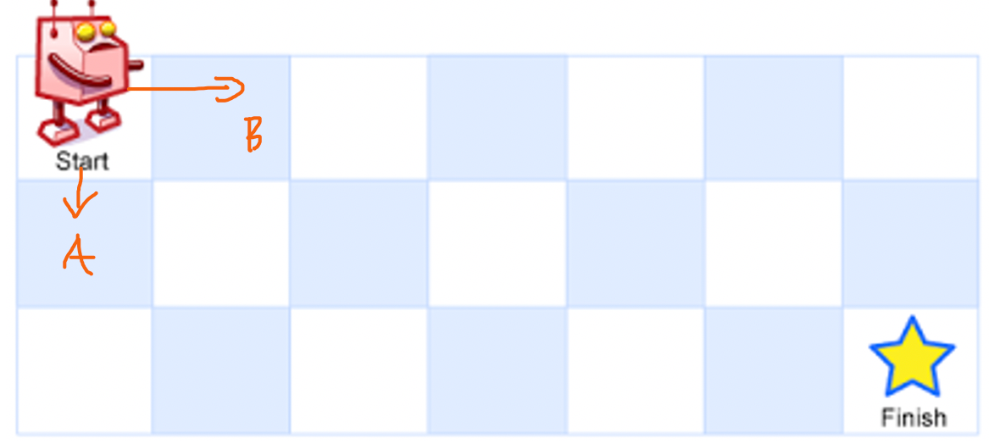
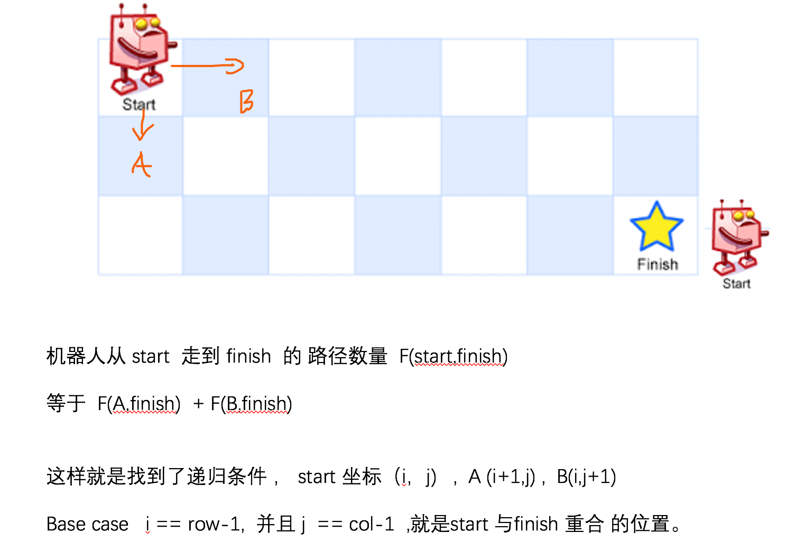
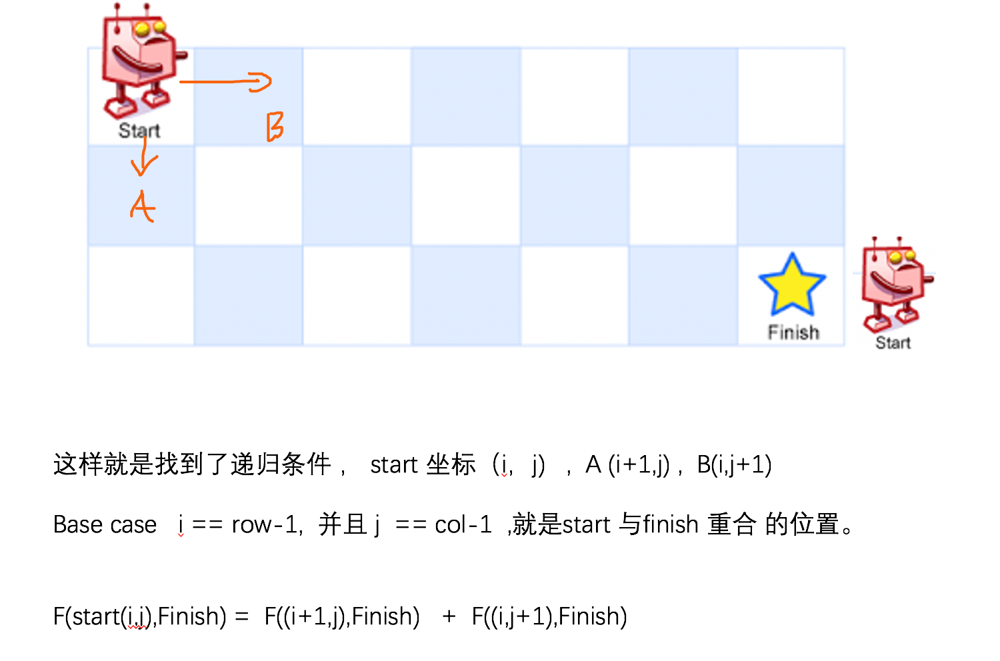

如何使用递归
============

[TOC]

1 递归概念 引入
---------------

​

​ 首先 思考一个小小的问题，计算机 是如何解决问题的？ 在计算机的世界里面
只有简单的

if else , for loop , while ,do while , recursion
等这些简单的指令集，计算机 是一个没有感情的机器，计算机更加喜欢 做的事情
是什么呢？

就是 **重复性的问题**\ ，计算机特别擅长。

所以 递归（recursion ） 就诞生了，所以 递归是什么呢？
递归就是自己调用自己的一个过程，是一种编程的技巧。

1.1来举一个简单 例子
~~~~~~~~~~~~~~~~~~~~

比如现在 我要计算 1 + 2 + … 100 ,举一个不是特别恰当的例子，假设
我现在有一个函数 可以从50 到100 计算和， 那么我只需要计算 1到50
的和，然后调用另外一个函数 计算 结果，然后把结果加起来。

.. code:: python

   def sum_to_hundred():
       """
       计算 1 + 2 + ... 100
       :return:
       """
       r = 0
       for i in range(1, 50):
           r += i

       r2 = sum_50_100()
       return r + r2

   def sum_50_100():
       """
       计算 50 到100 的和
       :return:
       """
       sum = 0
       for i in range(50, 101):
           sum += i
       return sum

   if __name__ == '__main__':

       r = sum_to_hundred()
       print(r)

例子 应该比较简单，但是我们应该思考 一个问题， 1 + 2 + 3 …+98+ 99+ 100
这个问题 会有一些自相似性。

换个角度想一想，如果我要计算1 + 2 + 3 …+ 98+ 99 + 100 的和，

如果是可以知道假设 1 + 2 + 3 …+98+ 99 = X ，上面的式子 X + 100

如果是可以知道假设 1 + 2 + 3 …+98 = Y ，上面的式子 Y + 99 + 100

如果是可以知道假设 1 + 2 + 3 …+97 = Z ，上面的式子 Z + 98 + 99 + 100

….

那么我们知道什么，很简单啊，

1 = XXX 等于 1 ，这里就是找了最初的结果。 所以我们尝试 用递归的方式
来实现一下 这个函数。

.. code:: python

   def recur(n=100):
           # base case 
       if n == 1:
           return 1
       return recur(n - 1) + n

这里我定义 recur(n) 表示的 从 [1,n] 的和.

recur(5)

recur(4) + 5

(recur(3) + 4) + 5

((recur(2) + 3)+ 4) + 5

(( (recur(1) + 2) + 3) + 4) + 5

因为 recur(1) 的结果我们 很清楚啊，就是1 ，所以计算机 就把 1 +2 +…+ 5
的结果 计算出来了。

1.2递归的一些必要条件
~~~~~~~~~~~~~~~~~~~~~

思考一下 递归需要哪些 必要的条件

-  base case 就是 基线 的条件

-  递归条件

递归的基线条件 就是 何时 结束递归 函数进行返回 上一个例子中， 就是 n==1
，这个条件 就是基线条件

第二点 递归的递归条件， 递归条件 是如何把 递归往 递归 条件上
改变的条件， 随着递归条件的不断变化，最终 可以到达 基线条件。
上一个求和的例子中 ``recur(n)  = recur(n-1) + n`` 这个就是递归条件。

我们按照算法时间复杂度的角度 重新思考这个问题， n 相当于问题规模，
递归条件 每次 把问题规模减低到一个 ， 最后降到
我们可以直接就可以看出结果的条件(base case).

好，现在 练手一下，如果 需要算法 ``n!`` 请使用递归的方式写出来

首先 思考 ： 基线条件是什么？ 第二 递归条件是什么 ？

.. code:: python

   def factorial(n: int) -> int:
       if n == 1:
           return 1
       return factorial(n - 1) * n

.. _如何使用递归-1:

2 如何使用递归
--------------

刚刚举例子，是比较简单的，这个时候你可能并没有感觉到递归
带来的好处是什么，我举几个稍微复杂的例子，

大家一起思考。

爬楼梯问题
~~~~~~~~~~

.. raw:: html

   

假设小明正在爬楼梯。需要 n 阶你才能到达楼顶。

.. raw:: html

   

.. raw:: html

   

每次你可以爬 1 或 2 个台阶。你有多少种不同的方法可以爬到楼顶呢？

.. raw:: html

   

.. raw:: html

   

注意：给定 n 是一个正整数。

.. raw:: html

   

.. raw:: html

   

示例 1：

.. raw:: html

   

.. raw:: html

   <pre><strong>输入：</strong> 2
   <strong>输出：</strong> 2
   <strong>解释：</strong> 有两种方法可以爬到楼顶。
   1.  1 阶 + 1 阶
   2.  2 阶</pre>

.. raw:: html

   

示例 2：

.. raw:: html

   

.. raw:: html

   <pre><strong>输入：</strong> 3
   <strong>输出：</strong> 3
   <strong>解释：</strong> 有三种方法可以爬到楼顶。
   1.  1 阶 + 1 阶 + 1 阶
   2.  1 阶 + 2 阶
   3.  2 阶 + 1 阶
   </pre>

假设小明 现在 在楼梯的开始上楼，

   image-20201108113754855

思考一下：

如果 小明 可以跳到 n 阶台阶，则 只有两种方案 可以跳上来。

假设 f(n) 表示 跳到 n 阶台阶的方法数， 那么

f(n) = f(n-1) + f(n-2)

想一想 base case

f(1) = 1

f(2) = 2

   image-20201108145637215

那么 比较容易些出来 以下的代码。

.. code:: python

   class Solution:
     
       def climbStairs(self, n: int) -> int:
           if n <= 2:
               return n
           else:
               return self.climbStairs(n-1) + self.climbStairs(n-2)

思考一下 这个 代码有没有什么问题呢？

画一下 递归的状态树， 这里 大概画了一下，

我们 从一下 可以看出 递归的状态 有大量的重复计算的问题。
如何解决这个问题呢？

其中 红色 部分， 绿色部分 都进行了重复的计算，所以可以把计算的结果
先保存起来，如果发现这个值 已经计算过了，直接 使用之前计算过的值 即可。

   image-20201108192205304

优化后的代码：

把重复计算的结果 保存起来

.. code:: python

   class Solution:

       memo = dict()

       def climbStairs(self, n: int) -> int:
           if n in self.__class__.memo:
               return self.__class__.memo[n]

           if n <= 2:
               self.__class__.memo[n] = n
           else:
               r = self.climbStairs(n - 1) + self.climbStairs(n - 2) 
               self.__class__.memo[n] = r
           return self.__class__.memo[n]

使用内置的 lru_cache 进行缓存 就行， 不用自己手写 lru_cache

.. code:: python

   from functools import lru_cache

   class Solution:

       @lru_cache(maxsize=128)
       def climbStairs(self, n: int) -> int:
           if n <= 2:
               return n
           else:
               return self.climbStairs(n-1) + self.climbStairs(n-2)

更好的解法 dp 法

.. code:: python

   class Solution:
     
       def climbStairs(self, n: int) -> int:

           if n <= 2:
               return n
           dp = [0] * (n + 1)
           dp[0] = 0
           dp[1] = 1
           dp[2] = 2

           for i in range(3, n + 1):
               dp[i] = dp[i - 1] + dp[i - 2]
           return dp[n]

括号生成问题
~~~~~~~~~~~~

.. raw:: html

   

数字 n 代表生成括号的对数，请你设计一个函数，用于能够生成所有可能的并且
有效的 括号组合。

.. raw:: html

   

.. raw:: html

   

 

.. raw:: html

   

.. raw:: html

   

示例：

.. raw:: html

   

.. raw:: html

   <pre><strong>输入：</strong>n = 3
   <strong>输出：</strong>[
          &quot;((()))&quot;,
          &quot;(()())&quot;,
          &quot;(())()&quot;,
          &quot;()(())&quot;,
          &quot;()()()&quot;
        ]
   </pre>

有效括号的含义 是指 是一个成对出现的括号， 是一个合法的括号的表达方式，
就如上面的例子。

假设 n = 3 这种情况，

   image-20201110222111289

先假设 没有 要求括号合法性 的要求

.. code:: python

   from typing import List

   class Solution:
       def generateParenthesis(self, n: int) -> List[str]:

           max_level = 2*n
           level = 0
           cur_result = ""
           self._generate(max_level=max_level,level=level,cur_result=cur_result)

       def _generate(self,max_level,level, cur_result):
           #  terminator
           if level == max_level:
               print(cur_result)
               # notice
               return

           # current logic ,and drill down next  level
           self._generate(max_level,level+1,cur_result+"(")
           self._generate(max_level,level+1,cur_result+")")

           # reverse  current level status
           pass

加上如何检查 括号的合法性的逻辑

其实递归的过程中，我们可以检查 一些不合法的括号，直接 停止递归就好了。

对于左括号，如果括号没有用完，就可以直接添加。

对于右括号， 要保证 左括号的了数量> 右括号的数量，就可以继续添加了。

.. code:: python

   from typing import List

   class Solution:
       def generateParenthesis(self, n: int) -> List[str]:

           max_level = n
           cur_result = ""
           left,right = 0,0
           self.result = []
           self._generate(max_level=max_level, left=left,right=right,cur_result=cur_result)
           return self.result

       def _generate(self,max_level,left,right, cur_result):
           #  terminator
           if left == max_level and right == max_level:
               # print(cur_result)
               self.result.append(cur_result)
               # notice
               return

           # current logic  ,and drill down
           if left < max_level:
               self._generate(max_level,left+1,right,cur_result+"(")
           if left > right:
               self._generate(max_level, left, right + 1, cur_result + ")")

           # reverse  current level status
           pass

这里 有一个模板尝试找一些题目进行练习。

.. code:: python

   # python
   def recursion(level, param1, param2, ...): 
       # recursion terminator 
       if level > MAX_LEVEL: 
          process_result 
          return 
       # process logic in current level 
       process(level, data...) 
       # drill down 
       self.recursion(level + 1, p1, ...) 
       # reverse the current level status if needed
       # pass
       

组合问题
~~~~~~~~

.. raw:: html

   

给定两个整数 n 和 k，返回 1 … n 中所有可能的 k 个数的组合。

.. raw:: html

   

.. raw:: html

   

示例:

.. raw:: html

   

.. raw:: html

   <pre><strong>输入:</strong>&nbsp;n = 4, k = 2
   <strong>输出:</strong>
   [
     [2,4],
     [3,4],
     [2,3],
     [1,2],
     [1,3],
     [1,4],
   ]</pre>

.. container::

   .. container::

      Related Topics

   .. container::

      .. raw:: html

         <li>

      回溯算法

      .. raw:: html

         </li>

思考一下 如何求解：

其实 只要吧转态树画出来 理解一下，就相对 简单一点。 当从
取出一个数后，之后 就不能取相同的数字，

所以 怎么控制取不到相同的数字呢？

想一想 递归的 基线条件是什么？

是不是递归的深度 level 等于 k 的时候，

每次递归的下一层的时候， 要从没有取到数开始
取，不能取到之前的数字，所以需要在递归 的时候 给一个 参数代表
当前层的开始的位置在哪里呢？ 这里我命名为 start 代表下一层开始的数字。

   image-20201110232026262

.. code:: python

   from typing import List

   class Solution:
       def combine(self, n: int, k: int) -> List[List[int]]:
           level = 0
           start = 1
           cur_result = []
           self.result = []
           self._generate(n, k, level=level, start=start, cur_result=cur_result)
           return self.result

       def _generate(self, n, k, level, start, cur_result:List):
           #  terminator
           if level == k:
               self.result.append(cur_result.copy())
               return

           #  currrent logic process  and drill down
           for i in range(start, n + 1):
               cur_result.append(i)

               self._generate(n, k, level + 1, start=i + 1, cur_result=cur_result)

               # reverse current level states
               cur_result.pop(-1)

               
   if __name__ == '__main__':
       r = Solution().combine(n=4, k=2)

       print(r)        

路径计数问题
~~~~~~~~~~~~

.. raw:: html

   

一个机器人位于一个 m x n 网格的左上角 （起始点在下图中标记为“Start” ）。

.. raw:: html

   

.. raw:: html

   

机器人每次只能向下或者向右移动一步。机器人试图达到网格的右下角（在下图中标记为“Finish”）。

.. raw:: html

   

.. raw:: html

   

问总共有多少条不同的路径？

.. raw:: html

   

.. raw:: html

   

.. raw:: html

   

.. raw:: html

   

例如，上图是一个7 x 3 的网格。有多少可能的路径？

.. raw:: html

   

.. raw:: html

   

 

.. raw:: html

   

.. raw:: html

   

示例 1:

.. raw:: html

   

.. raw:: html

   <pre><strong>输入:</strong> m = 3, n = 2
   <strong>输出:</strong> 3
   <strong>解释:</strong>
   从左上角开始，总共有 3 条路径可以到达右下角。
   1. 向右 -&gt; 向右 -&gt; 向下
   2. 向右 -&gt; 向下 -&gt; 向右
   3. 向下 -&gt; 向右 -&gt; 向右
   </pre>

.. raw:: html

   

示例 2:

.. raw:: html

   

.. raw:: html

   <pre><strong>输入:</strong> m = 7, n = 3
   <strong>输出:</strong> 28</pre>

.. raw:: html

   

 

.. raw:: html

   

.. raw:: html

   

提示：

.. raw:: html

   

.. raw:: html

   <ul>

.. raw:: html

   <li>

1 <= m, n <= 100

.. raw:: html

   </li>

.. raw:: html

   <li>

题目数据保证答案小于等于 2 \* 10 ^ 9

.. raw:: html

   </li>

.. raw:: html

   </ul>

   image-20201108181316963

由于机器人只能 向右 或者向下 走 。 这样就走到了重复 子问题了。

   image-20201108181334938

   image-20201108181813895

递归的写法

.. code:: python

   class Solution:
       def uniquePaths(self, m: int, n: int) -> int:
           i, j = 0, 0
           r = self.count_path(m, n, i, j)
           return r

       def count_path(self, row, col, i, j):
           # terminator
           if i >= row or j >= col:
               return 0
           if i == row-1 and j == col-1:
               # find a  result 
               return 1
           return self.count_path(row, col, i + 1, j) + self.count_path(row, col, i, j + 1)

记忆化搜索 可以把结果存起来

.. code:: python

   class Solution:
       def uniquePaths(self, m: int, n: int) -> int:
           i, j = 0, 0
           self.memo = dict()
           r = self.count_path(m, n, i, j)
           return r

       def count_path(self, row, col, i, j):
           if (i,j) in self.memo:
               return self.memo.get((i,j))

            # terminator
           if i >= row or j >= col:
               self.memo[(i, j)] = 0
               return self.memo[(i, j)]
           if i == row-1 and j == col-1:
               self.memo[(i, j)] = 1
               return self.memo[(i, j)]

           self.memo[(i, j)] = self.count_path(row, col, i + 1, j) + self.count_path(row, col, i, j + 1)
           return self.memo[(i,j)]

有没有 更好的办法？ 可以自行思考一下.

3 递归的效率问题
----------------

递归 有哪些 问题呢？

效率对比

递归的话，需要额外的栈的空间开销，这个需要一定空间成本的。 对于for 循环
就 不太需要，直接循环，不需要 额外的栈空间。

.. code:: python

   def recur(n=100):
       if n == 1:
           return 1
       return recur(n - 1) + n

   def my_sum(n):
       _sum = 0
       for i in range(n):
           _sum += i
       return _sum

   if __name__ == '__main__':
       n = 500
       start = time.time()
       print(my_sum(n=n))
       print(f"my_sum totoal time :{time.time() - start}")

       start = time.time()
       print(recur(n=n))
       print(f"recur totoal time :{time.time() - start}")
       pass

总结
----

递归的关键 要点 第一 要找到 最近重复子问题，第二要找base case 基线条件
。 然后 开始 写递归，递归过程中一定 不要忘记 递归的终止条件。

参考文档
--------

| `爬楼梯问题 <https://leetcode-cn.com/problems/climbing-stairs/>`__
| `括号生成问题 <https://leetcode-cn.com/problems/generate-parentheses/>`__
| `不同路径 <https://leetcode-cn.com/problems/unique-paths/>`__
| `组合 <https://leetcode-cn.com/problems/combinations/>`__
| `全排列 <https://leetcode-cn.com/problems/permutations/>`__
| `全排列 II <https://leetcode-cn.com/problems/permutations-ii/>`__

​
