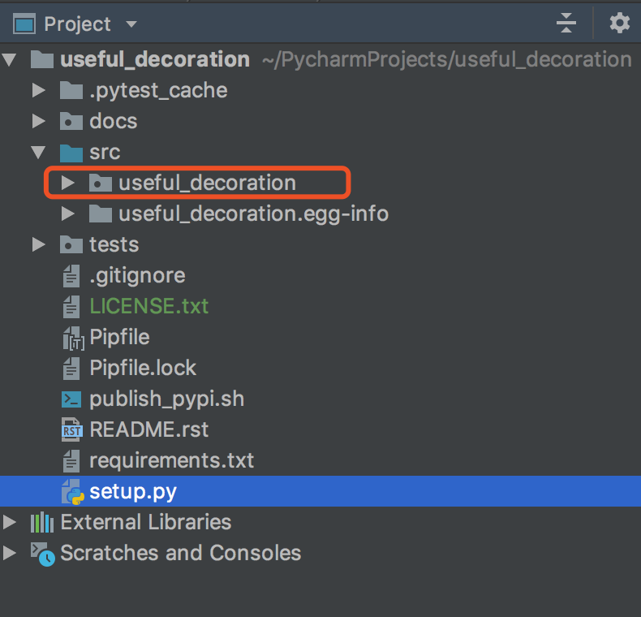
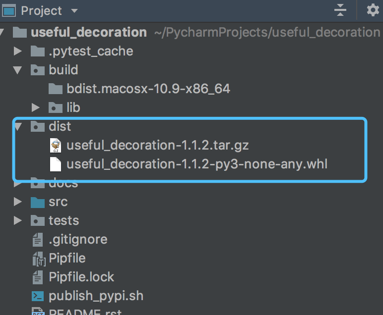

# 发布python包到官方pypi上面

[TOC]


举个例子  现在 要发布   useful_decroation   这个包 





发布一般需要 setup.py   ,  LICENSE.txt    package   ,README.rst     等   


## 1 首先 要写一个 setup.py  


主要通过这个 脚本来实现 发布  


```python
# -*- coding: utf-8 -*- 
"""
@User     : Frank
@File     : setup.py
@DateTime : 2019-09-16 11:24 
@Email    : frank.chang@lexisnexis.com
"""
from setuptools import setup,find_packages
import io
import re

with io.open('README.rst', 'r', encoding='utf8') as f:
    long_description = f.read()

with io.open("src/useful_decoration/__init__.py", "rt", encoding="utf8") as f:
    version = re.search(r'__version__ = "(.*?)"', f.read()).group(1)


setup(
    name="useful_decoration",
    license='Apache License 2.0',
    version=version,
    packages=find_packages("src"),
    zip_safe=False,
    include_package_data=True,
    package_dir={"": "src"},
    long_description=long_description,
    url='https://github.com/changyubiao/useful_decoration',
    author='frank',
    author_email='frank.chang@lexisnexis.com',
    description='powerful and useful decorations',

    project_urls={
        "Documentation": "https://useful-decoration.readthedocs.io/en/latest/",
        "Code": "https://github.com/changyubiao/useful_decoration",
    },

    python_requires='>=3.6',
    install_requires=[
        "loguru>=0.3.2",
    ],

)

```


有几个参数  说一下:  package 决定 你要 发哪个包 , 

name  就是报名 

url  项目地址 

version   可以在包里定义一个  \__version\_\_ 来制定 version  


find_packages  这个 是 官方提供自动寻找包的 一个方法, 他会寻找 package 下面的子包,如果 项目比较大 ,用这个比较方便.  

[setup 参数官方文档](https://setuptools.readthedocs.io/en/latest/setuptools.html#metadata)


## 2 配置pypirc 文件

在用户家目录 .pypirc

用户名 ,密码 从 pypi 官网 注册一个 , 写到 下面的配置文件里面 .

register  注册 用户名, 密码    https://pypi.org/account/register/


/c/Users/xxxxx/.pypirc


```python
[distutils]
index-servers=pypi

[pypi]
repository = https://upload.pypi.org/legacy/
username: changyubiao
password: xxxxxxxxx


[pypitest]
repository: https://test.pypi.org/legacy/
username:changyubiao
password:xxxxxxxxx

```


## 3 尝试  本地打包 发布 


如果  不确定 发布  正不正确,     可以 先  发到  pypitest 上面 进行测试 , 没问题 在像 官方pypi 里面发布包  

```python
# 用它来发布先安装 这个
pip install twine
# 打包用到的包 安装 相应依赖 
pip install setuptools wheel  

# 检查打包文件 
python setup.py  check 

# 打包
python setup.py sdist bdist_wheel


# 发布包
twine upload dist/*

```


如果 执行 check  没有  出现错误 ,就可以 正常  打包了 ,   生成 sdist ,  bdist_wheel 这两种包 . 


<!-- 
md 注释语法 


-->




执行 命令  会 生成 一个 dist build  两个目录 其中 dist   就是你  打包的内容 , 有两种格式  .tgz  , 还有一个 .whl  

这里面放的就是项目打包后的文件了.  可以 解压工具 看下  tar.gz 里面 是不是 你的 文件 都压缩好了. 

如果是 就问题不大了. 


下一步 就是发布包,   

```shell
twine  upload  dist/*
```

如果这里没有报错 就 说明已经发布上去了, 一切顺利. 


进入官网 搜一下, 发现 就有了 [useful-decoration](https://pypi.org/project/useful-decoration/)   https://pypi.org/project/useful-decoration/


## 4 可能遇到的障碍 

有可能 你的 项目 有一些 数据文件,  不是 xx.py 结尾的  默认 是不会 被打包的. 


pypi demo 官方文档 

1 Python Packaging User Guide   https://packaging.python.org/tutorials/packaging-projects/#semantic-versioning-preferred


2  Packaging and distributing projects 

https://packaging.python.org/guides/distributing-packages-using-setuptools/

3 打包数据文件 

https://setuptools.readthedocs.io/en/latest/setuptools.html#including-data-files

https://setuptools.readthedocs.io/en/latest/setuptools.html#find-namespace-packages


4  mainfest 是什么 可以用来 打包吗？ 用来 控制打包文件  

https://docs.python.org/2/distutils/sourcedist.html#manifest-template

打包数据 文件,  MANIFEST.in   可以 使用这个文件来定制化 ,需要 打包哪些, 需要排除哪些文件等. 


5 license.txt 配置 , 开源协议 

https://packaging.python.org/guides/distributing-packages-using-setuptools/#license-txt


## 5 参考文档  


[package-projects官方文档](https://packaging.python.org/tutorials/packaging-projects/)

[打包数据文件stackoverflow]( https://stackoverflow.com/questions/7522250/how-to-include-package-data-with-setuptools-distribute)

[useful-decoration项目地址](https://github.com/changyubiao/useful_decoration)   


<center>  <font color=gray size=1  face="黑体">
   分享快乐,留住感动.  '2019-10-31 22:09:18'  --frank 
	   </font>
</center>